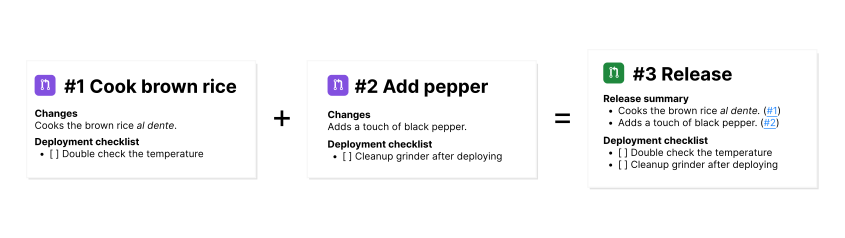

# release-summary



Improves your releasing workflow by propagating practical notes throughout your development lifecycle.

Works with any CI setup, simply provide two commit SHAs to diff against and this returns a formatted summary of all PR descriptions contained between them.

<p align="center">
  <a href="https://github.com/jhleao/release-summary/actions"></a>
</p>

## The problem

Consider the following scenario:

1. Your setup is one `main` branch, one `development` branch and a number of feature branches.
2. The `feature-1` branch has code from `developer-1`. This code has changes that require you to `change an environment variable in production as you deploy it`.
3. The `feature-2` branch has code from `developer-2`. This has changes that require you to `run a database migration script manually`.
4. Both branches are merged to `development`.
5. A day later, `developer-3` is assigned as the responsible for cutting a release, deploying and making sure everything works. But they have no context of what the changes are, what needs to be done manually (environment variables, migration scripts) and how to assess it's all working as it should.

It's typical that these notes are taken in a non-structured way. e.g. Slack, or outlined in each feature PR description. These approaches are error prone and likely get lost in space at one point or another, leading to malsupervised releases.

## The solution

Given two commit SHAs (e.g. a diff from a pull request), this GitHub Action finds all PR merges contained in this diff, parses their descriptions, and returns an aggregated version for easy review.

In practical terms, this helps you quickly get the gist of what is being merged, and helps with pushing notes and checklists throughout all the process.

How you format your notes is up to you. But as an example, say this is your pull request template:

```markdown
## Change description

> Description here

### Steps to verify this works as intended

- [ ] Intentionally left blank

### What needs to happen before, or right after deploying these changes?

- [ ] Intentionally left blank
```

To utilize `release-summary` with the template above, in the scenario described earlier, you would have the following file in `./.github/.summaryrc.yml`:

```yaml
ignore_containing: ['Intentionally left blank']

sections:
  - title: '## Release summary'
    style: condensed
    from: '## Change description'
    to: '### Steps to verify this works as intended'

  - title: '### Deployment checklist'
    style: multiline
    from: '### Steps to verify this works as intended'
    to: '### What needs to happen before, or right after deploying these changes?'

  - title: '### Steps to verify'
    style: multiline
    from: '### What needs to happen before, or right after deploying these changes?'
```

And the following workflow in `./.github/workflows/release-summary.yml`:

```yaml
name: Release summary

on:
  pull_request:
    types: [synchronize]
    branches: [main]

# Provide permissions for the workflow to read commit messages and write PR descriptions.
permissions:
  contents: read
  pull-requests: write

jobs:
  summarize:
    runs-on: ubuntu-latest
    steps:
      - name: Checkout code
        uses: actions/checkout@v2

      - name: Generate summary
        id: generate-summary
        uses: jhleao/release-summary@v1
        with:
          token: ${{ secrets.GITHUB_TOKEN }}
          base: ${{ github.event.pull_request.base.sha }}
          head: ${{ github.event.pull_request.head.sha }}

      - name: Update Current PR Description
        uses: actions/github-script@v5
        with:
          script: |
            await github.rest.pulls.update({
              owner: context.repo.owner,
              repo: context.repo.repo,
              pull_number: context.issue.number,
              body: `${{ steps.generate-summary.outputs.summary }}`,
            });
```

With the setup above, anytime someone opens a PR pointed at `main`, the PR description will be updated with a summary of all the changes contained in it, what needs to be tested and what needs to happen on deployment.

### Configuration

Configuration needs to be stored in in `./.github/.summaryrc.(yml|yaml)`:

```yaml
ignore_containing: ['If a section's content contains any of the strings here', 'it will be taken as empty.']

sections:
  - title: '## First section of your summary'
    style: condensed|multiline
    from: 'A string that marks the start of the section'
    to: 'if you omit `to`, it is defaulted to the next `from`. If there isn't one, the rest of the PR description is taken.'

  - title: '### Second section of your summary'
    style: condensed|multiline
    from: '### Header from one of your PR template sections'
```

### Caveats

This assumes merge commits contain the default merge message (i.e. starts with "Merge pull request #..."). This is how PR IDs are extracted from diffs.
